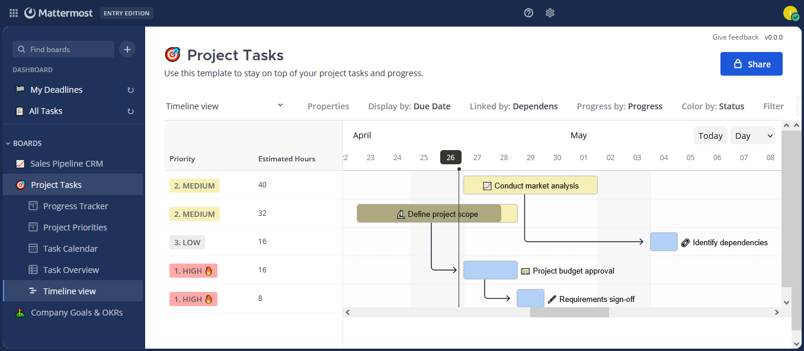
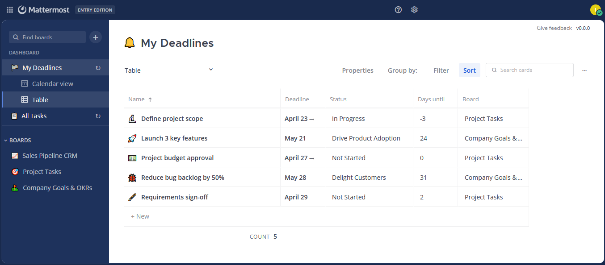
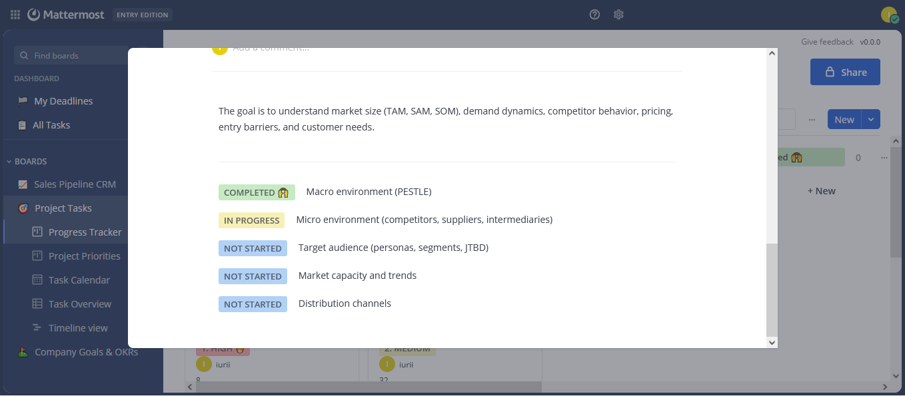
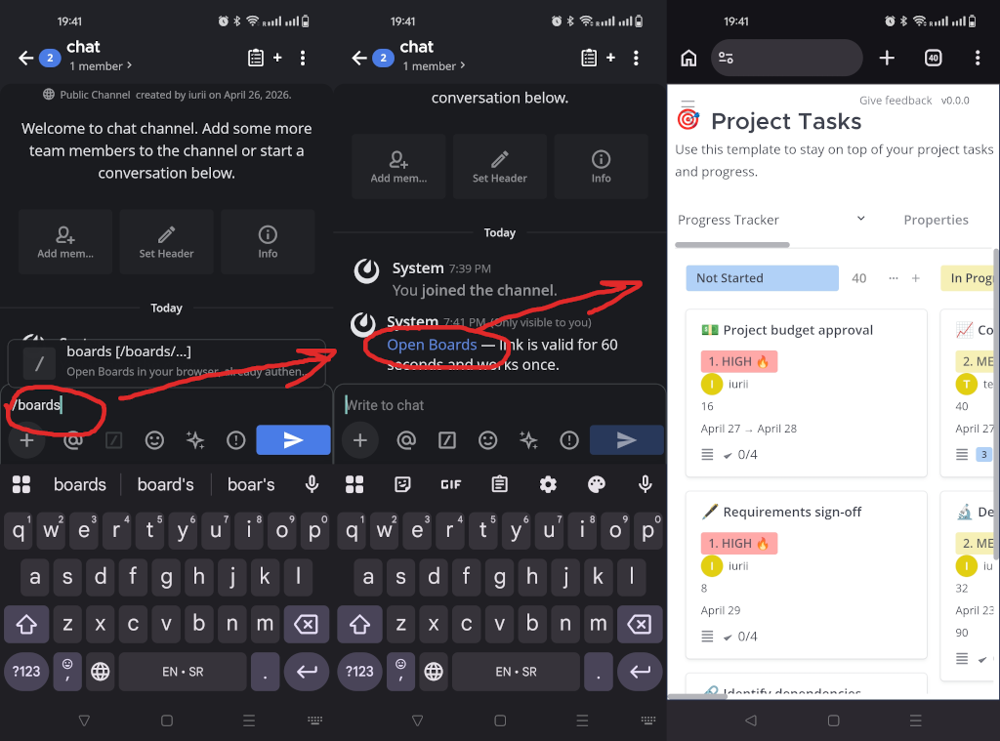

# mattermost-plugin-boards-pm

A project-management-flavoured fork of [mattermost-plugin-boards](https://github.com/mattermost/mattermost-plugin-boards) (Focalboard, the Boards plugin for Mattermost). Same plugin ID (`focalboard`), same data, drop-in upgrade — all your existing boards, cards, comments and history are preserved when you swap the upstream plugin for this build.

This fork adds Gantt-style scheduling, deadlines with reminders, dashboard boards, mobile login handoff and a number of card-detail improvements that make Boards usable as a lightweight project tracker.

> **Status:** active personal fork. Tracks upstream `main`; fixes from upstream are merged manually.

---

## What's added

### Timeline view (Gantt)

A new view type that renders cards as draggable bars on a calendar, sized by a date property of your choice. Supports parent → child dependency arrows, drag-to-reschedule with a cascade that shifts all linked descendants by the same delta, in-bar progress fill driven by a number property, and bar coloring driven by a select property. The left side panel shows visible card properties as a table with **per-column resize** (drag the right edge of a header).

<!-- IMG: timeline-view-overview -->


**Setup.** Create the view as you'd create any other view (`+` next to the view tabs → **Timeline**). Then configure it via the buttons in the view header bar:

| Header button | Sets | Accepts properties of type |
| --- | --- | --- |
| **Display by** | Date used to position and size each bar | `date`, `deadline`, `createdTime`, `updatedTime` |
| **Linked by** | Property that defines parent → child links | `task`, `multiTask` |
| **Progress by** | 0–100 number that fills the bar | `number` (values clamped to `[0, 100]`) |
| **Color by** | Bar fill color | `select` (color taken from the picked option) |

A bar is drawn for every card whose **Display by** property has at least a start date. Bars stretch from start to end if the property is a date range; same-day bars get a single tick.

**How dependency arrows are drawn.** **Linked by** is interpreted as "this card's children". On a parent card, set the **Linked by** property to the list of child cards. The Timeline draws an arrow from the parent's bar to each child's bar.

**Drag-to-reschedule cascade.** Dragging a bar shifts that card's start/end. If **Linked by** is set, the **same time delta** is applied to every descendant of the dragged card (BFS through the children). Cards with no value for the **Display by** property aren't included in the cascade.

**Side panel.** Whatever properties you mark as visible in **Properties** (top-right gear) show up as columns to the left of the chart. Drag the right edge of a column header to resize; widths persist per view and sync via Mattermost websocket to other clients.

### Deadline property + DM reminders

A new `deadline` property type that's a date with a reminder. When the deadline approaches, the assigned user (taken from a `Person (notify)` or `Multi person (notify)` property on the same card) receives a Mattermost DM with a link back to the card. No need to leave Boards open — Mattermost itself nudges you.

**Setup.** On the board:

1. Add a property of type **Deadline** (board header → **Properties** → **+ Add property** → pick **Deadline**). The property type **must** be `Deadline`, not the regular `Date` — only `deadline`-typed properties are scanned by the reminder ticker and the My Deadlines dashboard.
2. Add a property of type **Person (notify)** or **Multi Person (notify)** in the same way. Reminders are sent **only** to users listed in these properties; regular `Person` / `Multi Person` won't trigger them.
3. (Optional) Configure how far in advance the DM goes out. Click the deadline column header → property menu → **Reminder** → pick from `1 hour before`, `6 hours before`, `1 day before`, `2 days before`, `1 week before`. Default if unset: **24 hours before**.

**Behaviour.** A backend ticker runs every 10 minutes. Each card's deadline is checked once: if the current time has passed `deadline − reminder offset`, every assigned user (from the notify properties) gets one DM with the card title and a deep link, and the card is marked as notified so the same deadline never sends twice. To re-arm, change the deadline value.

### Person (notify) and Multi person (notify) properties

Variants of the existing `person` / `multiPerson` types that **send a DM to the user** the moment they're added to a card, with the card title and a link. The plain `person` variants stay quiet.

**Setup.** Standard property creation: board header → **Properties** → **+ Add property** → pick **Person (notify)** or **Multi Person (notify)**. The editor UI is identical to plain `Person` / `Multi Person`, so users won't see a visual difference; the type only changes the notification behaviour. Use plain `Person` / `Multi Person` for "informational" assignment fields and the `(notify)` variants for ones where every assigned user should be DM'd.

**When DMs fire.**

- A user is *added* to the property (whether on card creation or a later edit) → that user gets a DM. Users who were already in the property don't get re-notified.
- The user who made the edit doesn't DM themselves.
- Removing a user doesn't send anything.

These properties are **also** what the Deadline reminder and the My Deadlines dashboard use to figure out who's assigned to a card.

### Dashboard boards: My Deadlines and All Tasks

Two pinned items in the left sidebar that surface cross-board views without manually building them. Tap either to land on a synthetic, auto-refreshing board with the right cards in kanban + table view.

<!-- IMG: my-deadlines-board -->


**My Deadlines** — every card across every board you can see that has both:

- A property of type **Deadline** with a value set (regular `Date` properties don't count), and
- The current user listed in some property of type **Person (notify)** or **Multi Person (notify)** (plain `Person` properties don't count).

Sorted by deadline ascending, soonest first. Status (if a select property exists on the source board) and a link back to the original card are shown for each entry. Use this as your daily "what's overdue / what's due soon" list.

**Practical implication.** If you're already using a Boards setup with regular `Date` for due dates and regular `Person` for assignees, your cards **will not appear** in My Deadlines. Convert (or add) those properties to the `Deadline` and `(notify)` types to opt in.

**All Tasks** — every card you can see across every board you're a member of, sorted by last update (most recent first). No property requirements. Capped at **5000 cards**; if you have more, the oldest are dropped from the dashboard (the source boards are unaffected).

### Per-card activity history tab

Card detail now has **two tabs at the bottom**: Comments (the original) and **History**, which lists every property change, title rename, comment add/edit/delete and content-block edit on the card with the user, timestamp and before → after diff. Consecutive edits by the same user to the same property within 30 minutes coalesce into one entry, so a multi-day Timeline drag shows up as a single "5/3 → 5/8" line instead of one entry per day.

### Subtasks content block

A new content-block type for cards: a checklist that also tells you what state your subtasks are in (todo / in-progress / done counts). Useful for breaking a card down without spawning child cards.

<!-- IMG: subtasks-block -->


**Setup.** Open a card → click the `+` between content blocks (or use the `/` command inside the editor) → pick **Subtasks** from the block-type list. Each row gets a state cycle (todo → in-progress → done); the header strip shows the running count of each.

### Mobile experience

#### `/boards` slash command — one-tap mobile login-free open

Type `/boards` in any Mattermost channel (works in the mobile app too) and you get an ephemeral message with a single-use link that opens Boards in your browser **already authenticated** — no re-login. Backed by a server-side handoff endpoint that mints a short-lived MM session cookie when the link is followed (60-second TTL, single-use).

<!-- IMG: boards-slash-command -->


**Setup.** None — the slash command and the handoff endpoint are registered automatically when the plugin is enabled. Each user just types `/boards` from any channel they're in.

**Usage.**

- `/boards` — lands on the current team's last-opened (or first visible) board.
- `/boards /boards/team/<teamID>/<boardID>` — deep-links into a specific board. The path argument is whitelisted to `/boards/...` and `/plugins/focalboard/...` to prevent open-redirect.

The link expires after 60 seconds and works only once. Tap it again from the ephemeral message and it'll send you to a new login page; just run `/boards` again to mint a fresh link.

#### Touch UX

Touch DnD requires a 250ms long-press before drag starts, with a 20px scroll-tolerance threshold — so vertical scroll on phones no longer reorders cards. Sidebar auto-collapses after navigation on screens narrower than 768px, including for the new dashboard boards.

### AI agent integration via MCP server

Optional, off-by-default Model Context Protocol (MCP) server that lets the [Mattermost Agents (AI) plugin](https://github.com/mattermost/mattermost-plugin-agents) drive Boards on the user's behalf — list boards, search cards across all boards with rich filters, read full card detail, create / update cards, add comments. Every call runs under the requesting user's own permissions; the AI never sees boards or cards the user can't see.

**Enable it.** System Console → Plugins → **Mattermost Boards (PM fork)**:

| Setting | Default | What it does |
| --- | --- | --- |
| **Enable MCP Server** | off | Master switch. Off = no MCP at all. |
| **MCP Server Port** | `8975` | TCP port the loopback listener binds to. Pick any free port. |
| **MCP Shared Secret** | empty | Optional. If set, every MCP request must carry `Authorization: Bearer <secret>`. Recommended on shared servers. |

The listener only binds to `127.0.0.1` — never reachable from off the host. The plugin also exposes the same MCP endpoint through Mattermost's inter-plugin HTTP API at `plugin://focalboard/mcp` for callers that prefer to skip TCP.

**Wire up Mattermost Agents.** System Console → Agents → MCP → **Add server**:

- **Server URL:** `http://127.0.0.1:8975/mcp` (replace port if you changed it).
- **Headers:** leave empty unless you set the shared secret. If you did, add a single row `Authorization` = `Bearer <your-secret>`.
- **Per-user identity:** automatic. The Agents plugin auto-injects `X-Mattermost-UserID: <id>` on every call, and the MCP server uses that to scope all backend calls to the requesting user.

After adding the server, **remove and re-add it whenever you upgrade this plugin** — Agents caches the tool list at registration time and won't see newly added tools until re-registration.

**Tools exposed** (the AI agent picks these automatically based on user prompts):

| Tool | What it does |
| --- | --- |
| `get_current_user` | Returns the calling user's id, username, name, email — so the agent never has to ask "what's your user id?". |
| `list_my_boards` | Every non-template board across the user's teams, sorted by last update. |
| `get_board_info` | Schema for one board: properties, status / priority option lists, due-date property name, assignee-property names. Call this before creating or updating cards. |
| `search_cards` | Cross-board (or single-board) search with filters: text query, `assigned_to` (`me` / username / `any` / `unassigned`), `status`, `priority`, `due_date_range` (`overdue` / `today` / `this_week` / `next_week` / `YYYY-MM-DD..YYYY-MM-DD`), `has_subtasks`, `limit`. |
| `get_card_details` | Full card: title, description, status / priority / due / assignees, all comments with authors, subtasks blocks. |
| `create_card` | Title-and-shortcuts form (`assigned_to`, `status`, `priority`, `due_date`) plus a free-form properties dict. Accepts `"me"` for assigned_to. |
| `update_card` | Partial change dict, reads existing properties and merges so untouched fields survive. |
| `add_comment` | Posts a comment block on a card, attributed to the calling user. |

**Example prompts that work without further configuration:**

- "What tasks do I have on Project Tasks board, sorted by due date?"
- "Close my current 'In Progress' task and start the next highest-priority one."
- "Assign every unassigned card on Engineering to me, due in two days."
- "Comment on card ABC123 saying I'll finish it tomorrow."

**Verification (loopback only).** From the Mattermost host:

```bash
curl http://127.0.0.1:8975/health
# {"status":"ok"} when the listener is up

curl -s -X POST http://127.0.0.1:8975/mcp \
  -H 'Content-Type: application/json' \
  -H 'X-Mattermost-UserID: <your-mm-user-id>' \
  -d '{"jsonrpc":"2.0","id":1,"method":"tools/list"}' \
  | python -m json.tool
# Should list 8 tools: get_current_user, list_my_boards, get_board_info,
# search_cards, get_card_details, create_card, update_card, add_comment
```

If `/health` doesn't answer, the listener didn't start — check Mattermost server logs for `mcp:` lines (port collision, bind error, etc.).

### Card detail layout

The Comments + History tabs panel now stretches to the full width of the card body instead of shrinking to the longest comment, matching the content-blocks editor below it.

### Activity log polish

Timeline drag commits are now **idempotent** — committing the same end-state twice (which can happen on hybrid touch/mouse devices) creates only one history entry, not two. Combined with the 30-minute coalesce in the History tab, dragging a card across many days produces one clean entry instead of a dozen.

---

## Installation

### Drop-in upgrade from upstream `mattermost-plugin-boards`

The plugin ID is unchanged (`focalboard`), so installing this build replaces any existing `mattermost-plugin-boards` install **without touching the database**. All boards, cards, comments and history survive.

1. Grab `boards-*.tar.gz` from the [Releases](https://github.com/krotos139/mattermost-plugin-boards-pm/releases) page (or build it yourself, below).
2. In Mattermost: System Console → Plugin Management → Upload Plugin → pick the tar.gz.
3. Enable the plugin. Existing boards become accessible immediately.

### Optional: deadline reminders / mobile handoff / MCP server

- The deadline reminder scheduler runs server-side automatically — no admin toggle needed beyond enabling the plugin.
- The `/boards` slash command is registered automatically on plugin activation.
- The MCP server for AI agents is **off by default**. Turn it on per the [AI agent integration via MCP server](#ai-agent-integration-via-mcp-server) section above if you want the Mattermost Agents plugin to drive Boards.

---

## Building from source

`make` is unavailable on Windows; the plain commands below work on every platform. The full build instructions (including notes on CGO, the `repack_plugin.py` step required for executable bits on linux/darwin binaries, and the watch-mode workflow) are in the upstream README sections below.

```bash
# Webapp — both build (for webapp/dist/main.js, the runtime bundle) and
# pack (for webapp/pack/, the production bundle):
cd webapp
npm install
npm run build && npm run pack

# Server — five platforms, no CGO needed for the plugin:
cd ../server
mkdir -p dist
LDFLAGS='-X github.com/mattermost/focalboard/server/model.Edition=plugin'
for target in linux/amd64 linux/arm64 darwin/amd64 darwin/arm64 windows/amd64; do
  os=${target%/*}; arch=${target#*/}; ext=""
  [ "$os" = "windows" ] && ext=".exe"
  GOOS=$os GOARCH=$arch CGO_ENABLED=0 \
    go build -ldflags "$LDFLAGS" -trimpath \
    -o "dist/plugin-${os}-${arch}${ext}" .
done

# Bundle and re-pack so linux/darwin binaries get +x in the archive:
cd ..
PLUGIN_NAME=boards
rm -rf dist
mkdir -p dist/$PLUGIN_NAME/server dist/$PLUGIN_NAME/webapp
cp plugin.json LICENSE.txt NOTICE.txt dist/$PLUGIN_NAME/
cp -r assets pack public dist/$PLUGIN_NAME/ 2>/dev/null
cp -r webapp/pack dist/$PLUGIN_NAME/
cp -r server/dist dist/$PLUGIN_NAME/server/
cp -r webapp/dist dist/$PLUGIN_NAME/webapp/
python repack_plugin.py boards-pm.tar.gz
```

---

## Compatibility

- **Mattermost server:** 10.7.0+ (per `plugin.json` `min_server_version`).
- **Plugin ID:** `focalboard` (unchanged from upstream).
- **Database schema:** identical to upstream; no migrations of upstream tables.
- **Webapp bundle:** drop-in. `webapp/dist/main.js` is the runtime entrypoint Mattermost loads.

---

## Tracking upstream

```bash
git remote add upstream https://github.com/krotos139/mattermost-plugin-boards-pm.git
git fetch upstream
git merge upstream/main          # or rebase if you prefer
```

---

## License

Same as upstream — see [LICENSE.txt](./LICENSE.txt) and [NOTICE.txt](./NOTICE.txt). The fork-specific code is contributed under the same license terms.

---

## Upstream README (build & deploy reference)

### Getting started

Clone [mattermost](https://github.com/mattermost/mattermost-server) into a sibling directory.

Set the environment variable `MM_DEBUG=true` so the plugin compiles only for the host OS / architecture instead of all five target platforms on every build.

In your Mattermost configuration, ensure `PluginSettings.EnableUploads` is `true` and `FileSettings.MaxFileSize` is large enough to accept the plugin bundle (e.g. `256000000`).

### Installing dependencies

```sh
cd ./webapp
npm install
```

### Building (Makefile, on platforms where make is available)

```bash
make dist
```

After a successful build, a `.tar.gz` file in `/dist` can be uploaded to Mattermost.

### Deploying with local mode

If your Mattermost server is running locally, enable [local mode](https://docs.mattermost.com/manage/mmctl-command-line-tool.html):

```json
{
    "ServiceSettings": {
        "EnableLocalMode": true,
        "LocalModeSocketLocation": "/var/tmp/mattermost_local.socket"
    }
}
```

then deploy:

```bash
make deploy
```

For a webapp watch loop:

```bash
export MM_SERVICESETTINGS_SITEURL=http://localhost:8065
make watch-plugin
```

### Unit testing

```bash
make ci          # full local CI
make server-test # server unit tests only
cd webapp && npm run check && npm run test
```
